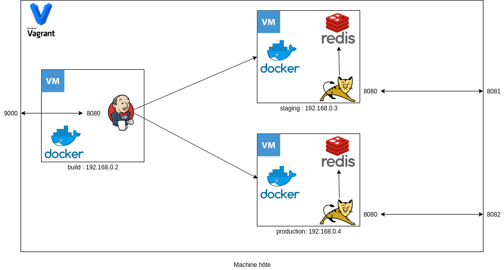

# click-count-devops

This project creates a set of Vagrant boxes containing a build server, a staging server and a production server.
The servers are configured using Ansible.

## Staging and production servers

The staging and production server are provisionned with docker and a redis container running as a docker container.
The redis container is in a private network.

## Build Server

The build server is provisonned with Docker and a Jenkins CI server.
The Jenkins jobs are created with the Ansible playbook.
The created job build a java application using a mvn docker container, push it to a registry and deploy it to staging and production.

## Architecture

The following schema describe the complete infrastructure:

## Pipeline

The build pipeline uses Jenkins pipeline to :

- checkout the project source
- build the war using a maven docker image
- build the production docker image (tomcat) and push it
- deploy the project to the staging server
- after validation from users, deploy the project to the production server

The pipeline is quite straighforward and can be found [here](./Jenkinsfile).

## Requirements

This project requires :

- Vagrant 2.2
- Ansible 2.7.10
- The following Ansible modules : geerlingguy.jenkins and geerlingguy.git

The project also requires the presence of an ssh key pair in ~/.ssh/id_rsa to start and allow the build server to access the other server.
A better implementation would need to create a ssh key pair and not rely on an external one.

## License

GPLv3